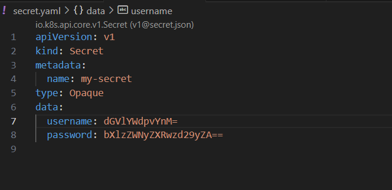
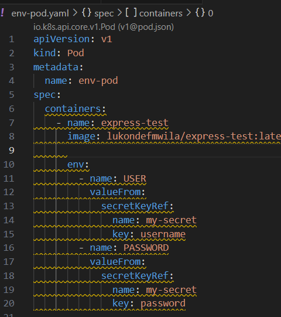
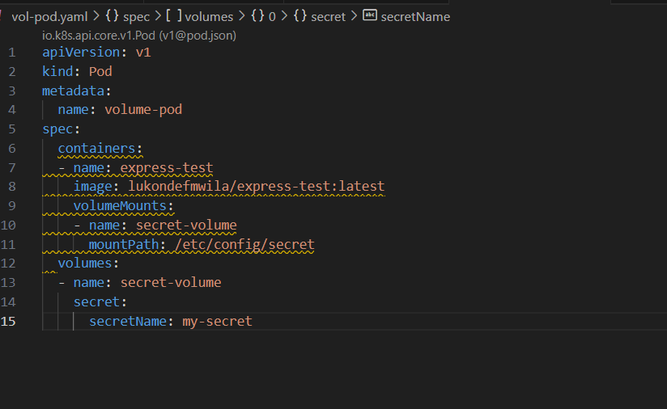

# KUBERNETES-SECRETS-CONFIGMAPS ##
With the continued growth of the cloud-native landscape, more companies are opting to run their workloads in Kubernetes, which necessitates testing and validating application environment behavior. In the context of Kubernetes, this can be achieved by using distinct resources:

ConfigMaps
Secrets
ConfigMaps are suitable for most configuration data scenarios. However, there is certain data that can be regarded as extra-sensitive, like passwords, security tokens, and other types of private keys. This type of data would be categorized as a Secret. Secrets are Kubernetes resources used to configure your applications with sensitive data that can be made accessible to your container workloads at runtime.

Kubernetes has native support for storing and handling this type of sensitive data with care. Depending on your use case, these Secrets can act as keys or methods of authentication in your computing environments. Let’s take a closer look at what Secrets are, the different types of Secrets that exist, and how to make use of them in your Kubernetes development lifecycle.

What are Kubernetes secrets?
The software development life cycle typically consists of working with multiple environments. As a result, you may want to pass dynamic values to your application at runtime to control its behavior. This kind of application configuration in Kubernetes can be carried out using either ConfigMaps or Secrets.

ConfigMaps and Secrets are distinct Kubernetes objects that have a similar function but serve different purposes.
Secrets handle small amounts of sensitive data to reduce the risk of accidental exposure of confidential information. Secret data should be stored and handled in a way that can be easily hidden and possibly encrypted at rest if the environment is configured as such. Kubernetes is insecure by default. This extends to Secrets because they are not encrypted. As soon as the Secret is injected into the Pod, the Pod itself can see the Secret data in plain text.

Secrets are stored inside the Kubernetes data store (i.e., an etcd database) and are created before they can be used inside a Pods manifest file. Furthermore, Secrets have a size limit of 1 MB. When it comes to implementation, you can either mount Secrets as volumes or expose them as environment variables inside the Pod manifest files.

There are a few different types of Secrets in Kubernetes:

Opaque: The default Secret type if one isn’t specified in the manifest configuration file. It allows you to provide arbitrary configuration data in key-value pairs.
Service account token: These store a token that identifies a specific service account. Of course, don’t forget to set the kubernetes.io/service-account.name annotation to an existing service account.
Docker config: This stores the credentials for a specific Docker registry for container images.
Basic authentication: These store basic authentication credentials. Note that their data fields need to include the username and password keys.
SSH authentication: These store SSH credentials. You’ll have to specify an ssh-privatekey key-value pair in the data or stringData field.
TLS: These Secrets store certificates and the associated keys used for TLS. You need to make sure the tls.key and the tls.crt keys are included in the data field of the Secret’s configuration.
Bootstrap token: These are tokens used during the node bootstrap process, used to sign ConfigMaps.

## Implementing secrets ##
In this section, you will create a Secret and mount it using the two approaches mentioned above.

Connect to a Kubernetes cluster
The first step is to ensure that you are connected to a Kubernetes cluster, either local or remote. The cluster setup and configuration used in this post can be found in this public repository.

You can verify the context of your cluster connection with the following command:

`kubectl config current-context`

## Create a secret manifest file ##
Once your connection is established, proceed to create a manifest file for a Secret. The Secret will contain key-value pairs for a username and password.

You can base64-encode the values for your secret as follows:

`echo -n 'jsmith' | base64`

`echo -n 'mysecretpassword' | base64`

Note that the outputs from the previous commands need to be pasted into the YAML file in the next section.

## Create a secret in a Kubernetes cluster ##
To create the Secret, use the kubectl command to reference the manifest file you just created. The request will be sent to the API Server in the Kubernetes Control Plane for the request to be actioned. Afterward, the data will be stored in the etcd data store of your cluster.

`kubectl create -f secret.yaml`

## Get secret ##
`kubectl get secret`

## Mount secret values with environment variables ##

In this step, you will create a Pod that will expose the Secret values as environment variables in a container at runtime. Once the Pod has been created, check the logs to verify that the values are accessible to the container based on an executed shell command.

Create the above Pod manifest file and execute the following command to create it in your cluster:

`kubectl create -f env-pod.yaml`

Once the Pod has been created, you can check the logs by running 
`kubectl logs name-of-pod`

## Mount secret values with volumes ##

Secrets can also be passed to containers in the form of mounted volumes. This will cause the configuration data to appear in files available to the container file system. Each top-level key in the configuration data will appear as a file containing all keys below that top-level key.

To test the Pod’s accessibility of the volume-mounted secret, you can connect to the container and run read commands in the volume directory.

`kubectl exec volume-pod -- ls /etc/config/secret`

`kubectl exec volume-pod -- cat /etc/config/secret/username`

## Conclusion ##
As we’ve discussed in this article, software teams typically configure computing environments to drive certain behavior in the development process. When developing in a Kubernetes environment, there are two ways of accomplishing this: ConfigFile and Secrets. If you have truly sensitive data, you should now be well-equipped to create, use, and access Secrets in your container workloads.
